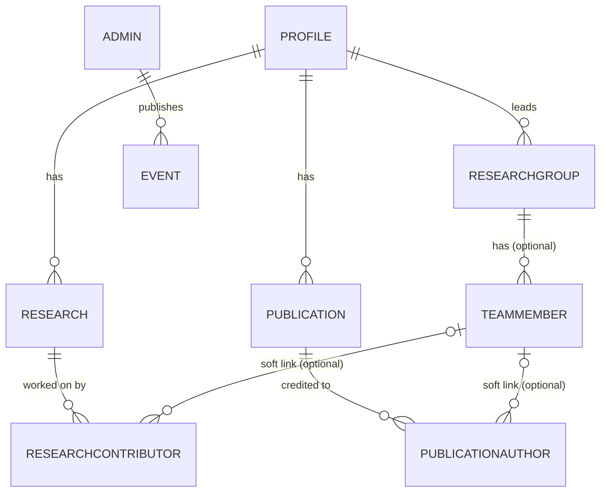

# Database

> **Source of truth for the schema:** `prisma/schema.prisma`. This page is a navigable summary —
> if the two disagree, the schema file wins.

## Engine & connection

- **Postgres**, hosted on **Supabase**. See [ADR-001](../decisions/ADR-001-database.md).
- **Prisma 7** — Rust-free client, connection URL lives in `prisma.config.ts` (not
  `schema.prisma`), `PrismaClient` instantiated with a driver adapter
  (`@prisma/adapter-pg` over a plain `pg` `Pool`) in `src/modules/shared/lib/prisma.ts`, **not**
  `@prisma/adapter-neon`.
- App uses the **pooled** `DATABASE_URL` (port 6543, pgbouncer); migrations use the **direct**
  `DIRECT_URL`. `npm run predev` runs `prisma migrate deploy` before `next dev`.
- **Prisma is imported only in repository files** (`src/modules/*/*.repository.ts`) — a hard rule,
  never relaxed for convenience.

## Models

| Model | Purpose | Notes |
|---|---|---|
| `Profile` | Singleton professor bio | Identity and prose only: name, title, photo, bio, position, research statement, `linkedinUrl`/`googleScholarUrl`. The seven `Json` list columns moved to `cv_entry` on 2026-09-02 ([ADR-012](../decisions/ADR-012-cv-entries-and-courses.md)). |
| `CvEntry` | CV lines, tagged by `section` | One table with a `CvSection` discriminator, not seven — every section carries the same four fields. Five sections render on About, two on Teaching. |
| `Course` | Taught courses | Backs the Teaching tab, grouped by free-text `level`. |
| `Research` | Research works | `link` nullable. Contributors are `ResearchContributor` rows, not a column. |
| `Publication` | Publications | `link` nullable (conference/book-chapter entries often have no stable URL). The free-text `authors` column was **removed** 2026-09-06 ([ADR-015](../decisions/ADR-015-attribution-rows.md)) — replaced by `PublicationAuthor` rows. |
| `PublicationAuthor` | Credited authors, in citation order | Join row: cascade from `Publication`, nullable `teamMemberId` (`onDelete: SetNull`), and a `name` snapshot that is what renders. **Zero rows means the professor's own solo work** — the reason attribution is rows rather than nullable columns. |
| `ResearchContributor` | Credited contributors | Same shape as `PublicationAuthor`; `sortOrder` is display order only, with no citation meaning. |
| `ResearchGroup` | Research groups | Has-many `TeamMember`. `members` JSON blob was **removed** — replaced by the relational entity below. |
| `TeamMember` | Researchers & visiting professors | `researchGroupId` nullable FK (`onDelete: SetNull`) — a member may be unaffiliated. |
| `Event` | Admin-authored events on the public Events tab | See below. |
| ~~`Appointment`~~ | ~~Admin-declared appointments~~ | **Deleted 2026-09-01 ([ADR-011](../decisions/ADR-011-events-replace-appointments.md)),** along with the `AppointmentStatus` enum and every row. Replaced by `Event`. |
| ~~`Setting`~~ | ~~Key/value flags~~ | **Deleted 2026-08-13 (ADR-010).** Held one key, `upcoming_events_visible`. |
| `User`/`Session`/`Account`/`Verification` | Better Auth's own tables | Owned by Better Auth's Prisma adapter — **never query these from domain code**; only `src/modules/auth/auth.ts` hands the client to the adapter. |
| `AuditLog` | Append-only audit trail | Written by repositories, not services — see [architecture/backend.md](backend.md#audit-logging). |

### `Event` — current shape

```prisma
model Event {
  id          String   @id @default(cuid())
  title       String
  description String
  eventDate   DateTime            // the only thing that decides Upcoming vs Past
  photoUrls   String[]            // public R2 URLs
  videoUrls   String[]            // parsed 11-character YouTube video IDs, never files
  createdAt   DateTime
  updatedAt   DateTime
}
```

**Fields that deliberately do not exist:** any status or lifecycle enum, `isPublic`/draft flag, and
any stored upcoming/past marker. An event is published the moment it is saved, and whether it is
upcoming is derived from `eventDate` against the clock at render time (`splitByTiming` in
`event.service.ts`) — a stored flag would be wrong the moment the date passed with nobody editing.
See [ADR-011](../decisions/ADR-011-events-replace-appointments.md).

**Media are native Postgres `text[]`,** not `Json`: flat lists of URLs with no internal structure.
A partial update replaces an array wholesale (`{ set: [...] }`), so a PUT carrying `photoUrls: []`
clears the gallery rather than reading as "no change".

## Conventions

- Models: `PascalCase` singular. Fields: `camelCase`, mapped to `snake_case` columns via
  `@map`/`@@map`.
- IDs: `String @id @default(cuid())`.
- Every domain entity has `createdAt`/`updatedAt` (`@default(now())` / `@updatedAt`).
- Domain code never sees Prisma's generated types directly outside repositories — repositories
  map rows to plain domain types (e.g. `toDomain()` in `event.repository.ts`).

## Relationships



Both attribution relationships are optional on both sides: an item with zero rows is the
professor's own solo work, and a row with no `teamMemberId` is an outside collaborator who exists
only as a name (2026-09-06, [ADR-015](../decisions/ADR-015-attribution-rows.md)).

There is no `Setting` model (deleted 2026-08-13, ADR-010) and no `Appointment` model (deleted
2026-09-01, ADR-011). Nothing gates event visibility: every event is public.

## Event lifecycle

There isn't one. `Event` has no status column and no state machine, so no event operation can
return `409` — the only transitions are create, edit, delete. Deleting is audited: `AuditLog`
captures the full before-state inside the same transaction as the delete.

The appointment state machine that used to be documented here (`scheduled → cancelled`, reschedule,
hard delete) was removed on 2026-09-01 — see
[ADR-011](../decisions/ADR-011-events-replace-appointments.md), and
[ADR-010](../decisions/ADR-010-appointment-hard-delete-reschedule-per-appointment-visibility.md)
for the history.

## Migration strategy

- Dev: `npm run db:migrate` (`prisma migrate dev`). **Never** run `migrate dev` against
  production — CI/CD runs `npm run db:deploy` (`prisma migrate deploy`).
- Migration history (`prisma/migrations/`) is itself a readable record of the schema's evolution —
  e.g. `20260807143226_simplify_appointments_admin_only` and
  `20260808044253_appointment_embed_only_no_calendly_sync` document the 2026-08-08 rewrite, and
  `20260901120000_events_replace_appointments` the removal, at the SQL level. That last one is
  **destructive and has no down path** — it drops `appointment` and every row in it.
- `prisma/seed.ts` provisions the single admin from `ADMIN_EMAIL`/`ADMIN_INITIAL_PASSWORD`;
  `prisma/seed-demo.ts` adds demo content for local dev. Guard seed scripts so they never run
  destructively in production.
