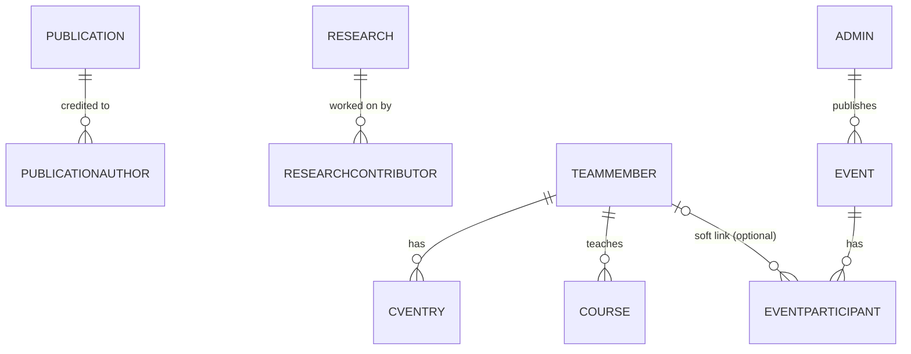

# Database

> **Source of truth for the schema:** `prisma/schema.prisma`. This page is a navigable summary —
> if the two disagree, the schema file wins.

## Engine & connection

- **Postgres**, hosted on **Supabase**. See [ADR-001](../decisions/ADR-001-database.md).
- **Prisma 7** — Rust-free client, connection URL lives in `prisma.config.ts` (not
  `schema.prisma`), `PrismaClient` instantiated with a driver adapter
  (`@prisma/adapter-pg` over a plain `pg` `Pool`) in `src/modules/shared/lib/prisma.ts`, **not**
  `@prisma/adapter-neon`.
- App uses the **pooled** `DATABASE_URL` (port 6543, pgbouncer); migrations use the **direct**
  `DIRECT_URL`. `npm run predev` runs `prisma migrate deploy` before `next dev`.
- **Prisma is imported only in repository files** (`src/modules/*/*.repository.ts`) — a hard rule,
  never relaxed for convenience.

## Models

| Model | Purpose | Notes |
|---|---|---|
| `Profile` | Singleton — the **lab's** profile | Since 2026-09-11 ([ADR-016](../decisions/ADR-016-lab-team-profiles.md)): `labName`, `labTagline`, `logoUrl`, `labOverview`, `positionAffiliation` (the lab's department), research statement, Calendly link and the per-tab intros. The professor's personal fields moved to her `TeamMember` row. |
| `CvEntry` | CV lines, tagged by `section` | One table with a `CvSection` discriminator ([ADR-012](../decisions/ADR-012-cv-entries-and-courses.md)). Required `teamMemberId` (cascade) since ADR-016 — renders on that member's profile page. |
| `Course` | Taught courses | Required `teamMemberId` (cascade) since ADR-016; grouped by free-text `level` on the member's profile page. |
| `Research` | Research works | `link` nullable. Contributors are `ResearchContributor` rows, not a column. |
| `Publication` | Publications | `link` nullable (conference/book-chapter entries often have no stable URL). The free-text `authors` column was **removed** 2026-09-06 ([ADR-015](../decisions/ADR-015-attribution-rows.md)) — replaced by `PublicationAuthor` rows. |
| `PublicationAuthor` | Credited authors, in citation order | `{ name, sortOrder }` rows, cascading from `Publication`. `teamMemberId` and `isProfileOwner` were **removed** 2026-09-11 ([ADR-016](../decisions/ADR-016-lab-team-profiles.md)): a name that matches a member's `name` or `citationName` is highlighted at render time, nothing is stored. |
| `ResearchContributor` | Credited contributors | Same shape as `PublicationAuthor`; `sortOrder` is display order only. |
| ~~`ResearchGroup`~~ | ~~Research groups~~ | **Dropped 2026-09-11 (ADR-016)**, with every member outside "Culprit Web Development Team". |
| `TeamMember` | Lab members, including the director | `teamKind` (`director`/`professor`/`research`/`development`, NOT NULL, no DB default) groups them on the Team tab and decides what their profile page may have — see below. `isDirector` marks the director — at most one, via the **partial unique index** `team_member_one_director`, which Prisma cannot express (documented drift) — and is kept true exactly when `teamKind` is `director`. Also `citationName`, `affiliation`. Has-many `CvEntry`, `Course`, `Project` and `MemberLink`. `nickname`, `showOnTeamTab` and `researchGroupId` were removed (ADR-016); `linkedinUrl` and `googleScholarUrl` were removed 2026-09-12 ([ADR-017](../decisions/ADR-017-team-kinds-projects-member-links.md)). |
| `Project` | Work owned by one member | *(new 2026-09-12, ADR-017)* `{ title, summary, link?, sortOrder }`, required `teamMemberId` (cascade). Renders only on that member's profile page. Not a `Research` row — research is lab output with a byline and no owner. |
| `MemberLink` | A member's external profiles | *(new 2026-09-12, ADR-017)* `{ label, url, sortOrder }`, required `teamMemberId` (cascade). `label` is free text ("LinkedIn", "GitHub", "Portfolio") — no enum, because the set of profiles a person has is open. Replaced the two fixed link columns; the migration backfilled both into rows before dropping them. Written as part of the member, replaced in one transaction. |
| `Event` | Admin-authored events on the public Events tab | See below. |
| ~~`Appointment`~~ | ~~Admin-declared appointments~~ | **Deleted 2026-09-01 ([ADR-011](../decisions/ADR-011-events-replace-appointments.md)),** along with the `AppointmentStatus` enum and every row. Replaced by `Event`. |
| ~~`Setting`~~ | ~~Key/value flags~~ | **Deleted 2026-08-13 (ADR-010).** Held one key, `upcoming_events_visible`. |
| `User`/`Session`/`Account`/`Verification` | Better Auth's own tables | Owned by Better Auth's Prisma adapter — **never query these from domain code**; only `src/modules/auth/auth.ts` hands the client to the adapter. |
| `AuditLog` | Append-only audit trail | Written by repositories, not services — see [architecture/backend.md](backend.md#audit-logging). |

### Per-team attribute rules (ADR-017)

`TEAM_KIND_RULES` in `src/modules/shared/lib/team-kind.ts` is the single definition. The teaching
service enforces it on write; the team-member service gates on it when reading a profile.

| team | CV sections | courses | projects | credited research + publications | links |
|------|-------------|---------|----------|----------------------------------|-------|
| `director` | all seven | yes | yes | yes | yes |
| `professor` | all seven | yes | yes | yes | yes |
| `research` | `research_interest` only | no | yes | yes | yes |
| `development` | none | no | yes | no | yes |

A violation is a `400 validation_error` with `fieldErrors` — not `409` (there are no state machines
here) and not `422` (`ValidationError` maps to 400 for the whole app).

Changing a member's team **never deletes rows and is never blocked by rows that exist.** Rows that
the new team may not have stop rendering publicly and become delete-only in the admin. Deleting on a
team change would destroy real history to enforce a display rule; refusing the change would force the
admin to delete someone's CV before reclassifying them.

The rules table lives in `shared` rather than in `research-groups` or `teaching` because both
enforce it — writes in one, reads in the other — and either home would create a module cycle. Its
only import is a **type-only** `CvSection`, erased at build.

### `Event` — current shape

```prisma
model Event {
  id          String   @id @default(cuid())
  title       String
  description String
  eventDate   DateTime            // the only thing that decides Upcoming vs Past
  photoUrls   String[]            // public R2 URLs
  videoUrls   String[]            // parsed 11-character YouTube video IDs, never files
  createdAt   DateTime
  updatedAt   DateTime
}
```

**Fields that deliberately do not exist:** any status or lifecycle enum, `isPublic`/draft flag, and
any stored upcoming/past marker. An event is published the moment it is saved, and whether it is
upcoming is derived from `eventDate` against the clock at render time (`splitByTiming` in
`event.service.ts`) — a stored flag would be wrong the moment the date passed with nobody editing.
See [ADR-011](../decisions/ADR-011-events-replace-appointments.md).

**Media are native Postgres `text[]`,** not `Json`: flat lists of URLs with no internal structure.
A partial update replaces an array wholesale (`{ set: [...] }`), so a PUT carrying `photoUrls: []`
clears the gallery rather than reading as "no change".

## Conventions

- Models: `PascalCase` singular. Fields: `camelCase`, mapped to `snake_case` columns via
  `@map`/`@@map`.
- IDs: `String @id @default(cuid())`.
- Every domain entity has `createdAt`/`updatedAt` (`@default(now())` / `@updatedAt`).
- Domain code never sees Prisma's generated types directly outside repositories — repositories
  map rows to plain domain types (e.g. `toDomain()` in `event.repository.ts`).

## Relationships



Bylines have no relation to members: an author row is a typed name, and the public lists highlight
the names that match a member (2026-09-11, [ADR-016](../decisions/ADR-016-lab-team-profiles.md)).
`Profile` is a standalone singleton for the lab.

There is no `Setting` model (deleted 2026-08-13, ADR-010) and no `Appointment` model (deleted
2026-09-01, ADR-011). Nothing gates event visibility: every event is public.

## Event lifecycle

There isn't one. `Event` has no status column and no state machine, so no event operation can
return `409` — the only transitions are create, edit, delete. Deleting is audited: `AuditLog`
captures the full before-state inside the same transaction as the delete.

The appointment state machine that used to be documented here (`scheduled → cancelled`, reschedule,
hard delete) was removed on 2026-09-01 — see
[ADR-011](../decisions/ADR-011-events-replace-appointments.md), and
[ADR-010](../decisions/ADR-010-appointment-hard-delete-reschedule-per-appointment-visibility.md)
for the history.

## Migration strategy

- Dev: `npm run db:migrate` (`prisma migrate dev`). **Never** run `migrate dev` against
  production — CI/CD runs `npm run db:deploy` (`prisma migrate deploy`).
- Migration history (`prisma/migrations/`) is itself a readable record of the schema's evolution —
  e.g. `20260807143226_simplify_appointments_admin_only` and
  `20260808044253_appointment_embed_only_no_calendly_sync` document the 2026-08-08 rewrite, and
  `20260901120000_events_replace_appointments` the removal, at the SQL level. That last one is
  **destructive and has no down path** — it drops `appointment` and every row in it.
- `prisma/seed.ts` provisions the single admin from `ADMIN_EMAIL`/`ADMIN_INITIAL_PASSWORD`;
  `prisma/seed-demo.ts` adds demo content for local dev. Guard seed scripts so they never run
  destructively in production.
